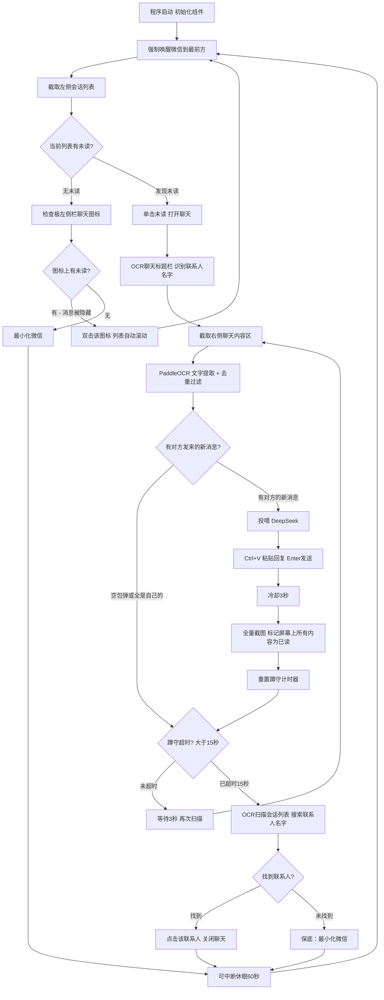
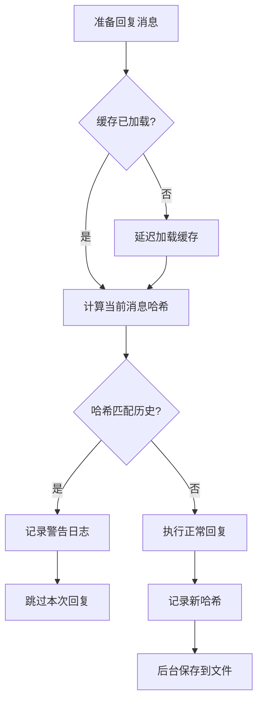

# 微信 GUI Agent 架构及开发记录

## 项目目标
开发一款从零开始、纯视觉、脱离底层协议与内存 Hook 的个人微信 AI 助手，采用 GUI 智能体架构。通过窗口抓取、OCR、大模型与拟人化模拟进行消息收发，实现高兼容性和极高隐私安全。

## 目录结构
```text
/
├── main.py                  # 全局入口：启动 pywebview 窗口（1024×720 可缩放），挂载 AppApi 桥接
├── calibrate.py             # 首次使用坐标校准工具（交互式画框）
├── .env                     # 🔒 敏感密钥（LLM API Key），已被 .gitignore 屏蔽
├── .gitignore               # Git 忽略规则
├── core/                    # 核心自动化引擎模块
│   ├── __init__.py
│   ├── engine.py            # WeChatEngine 引擎类（主循环 + 跟踪追击 + 可中断休眠）
│   ├── window_manager.py    # 窗口控制模块（激活、锁定、最小化、DPI 感知）
│   ├── vision.py            # 视觉截屏与 HSV 未读检测（线程安全 mss + 交互式校准）
│   ├── ocr_parser.py        # PaddleOCR 识别与消息解析（归属判断、去重、digest 模式）
│   ├── agent.py             # LLM 大脑模块（DeepSeek/OpenAI 兼容，.env 优先读取）
│   ├── action.py            # 执行层模块（拟人化输出、剪贴板注入、双击）
│   └── anti_risk.py         # 防风控与伪装模块
├── data/                    # 数据与持久化配置
│   ├── config.yaml          # 🔒 个人坐标/参数配置，已被 .gitignore 屏蔽
│   ├── config.example.yaml  # 配置模板文件（供新用户参考）
│   ├── reply_hash_cache.json # 🔒 P1 防鞭尸缓存（自动生成），已被 .gitignore 屏蔽
│   ├── contacts.yaml        # [规划中] 联系人分组与人设绑定
│   └── knowledge/           # [规划中] RAG 本地知识库
├── ui/                      # 图形控制台界面
│   ├── index.html           # 主页面（HTML结构，378行）
│   ├── css/                 # 样式文件目录
│   │   └── main.css         # 主样式表（333行，深色玻璃拟态主题）
│   └── js/                  # 脚本文件目录
│       └── app.js           # 主应用脚本（1294行，前后端桥接+业务逻辑）
├── requirements.txt         # 项目依赖
├── ARCHITECTURE.md          # 开发文档与架构说明（本文件）
└── README_STRUCTURE.md      # 项目目录结构说明
```

---

## 主循环 V3.1 架构设计（极简回复 + 全量缓存 + 安全蹲守）

> **V2 的教训：** 双轨扫描引入了大量边界 Bug（自我污染、启动暴走、切换误触）。越修越乱！
> **V3 核心思想：** 只信赖红点。每 60 秒唤醒微信扫描一次，扫完立刻最小化。
> **V3.1 回复策略：** 回复后立刻全量截图缓存（标记屏幕上所有内容为已读），3 秒后开始蹲守，只对「对方发来的真正新消息」做出回复，杜绝自言自语。



### V3.1 关键设计

| 维度 | 说明 |
|------|------|
| **巡逻周期** | 每 60 秒唤醒微信扫描一次，扫完立刻最小化，不影响用户使用电脑 |
| **打开聊天** | 单击未读标志进入聊天界面 |
| **联系人识别** | 进入聊天后 OCR 标题栏，提取当前联系人名字（为后续联系人库做铺垫） |
| **回复策略** | 仅对 `sender=="them"` 的新消息回复，忽略自己和系统消息 |
| **消化策略** | 回复后冷却 3 秒 → 全量截图缓存（包括对方消息），防止重复回复和自言自语 |
| **蹲守机制** | 回复后重置 15 秒倒计时，蹲守期间每 3 秒扫描一次检测新回复 |
| **关闭聊天** | 蹲守超时后，OCR 扫描会话列表搜索联系人名字，找到新位置后点击关闭 |
| **保底策略** | 若 OCR 未识别到名字或在列表中找不到，最小化微信兜底 |
| **防死循环** | 全量缓存确保秒回被标记已读，3 秒后的真正新消息才触发下一轮回复 |

---

## P1 阶段：工业级安全防线 (V1.2)

> **设计理念**：在自动执行层面对抗失控风险的最后防线，确保 AI 助手在商业场景中的安全性和可靠性。

### 三层防护架构

```text
┌─────────────────────────────────────────────────────────┐
│  第三层：输出风控护栏 (Agent 层)                          │
│  ├─ 正则黑名单：拦截高危词汇（转账、密码、退款等）         │
│  ├─ 安全话术：命中时替换为人工审核提示                   │
│  └─ 告警日志：记录所有风控事件供人工审查                 │
└─────────────────────────────────────────────────────────┘
                         ↓
┌─────────────────────────────────────────────────────────┐
│  第二层：防鞭尸状态机 (Engine 层)                         │
│  ├─ 消息哈希：MD5 指纹识别重复内容                       │
│  ├─ 按联系人缓存：独立存储每个会话的回复历史              │
│  ├─ 持久化：JSON 文件存储，程序重启不丢失                │
│  └─ 延迟加载：首次使用时加载，避免初始化递归             │
└─────────────────────────────────────────────────────────┘
                         ↓
┌─────────────────────────────────────────────────────────┐
│  第一层：物理级防冲突中断 (Action 层)                     │
│  ├─ 焦点窗口校验：Ctrl+V/Enter 前验证微信仍为前台        │
│  ├─ 鼠标抢夺检测：100px 阈值检测用户干预                 │
│  ├─ 降级策略：pywin32 缺失时自动降级，记录警告           │
│  └─ 异常保护：所有检查失败不中断主流程                   │
└─────────────────────────────────────────────────────────┘
```

### 1. 物理级防冲突中断 (Action 层)

#### 核心功能
**文件**：`core/action.py`

| 方法 | 功能 | 触发时机 |
|------|------|----------|
| `_refresh_wechat_handle()` | 枚举并缓存微信窗口句柄 | 初始化时 |
| `_verify_foreground_window()` | 验证当前前台窗口是否为微信 | Ctrl+V 前 / Enter 前 |
| `_check_mouse_hijack()` | 检测鼠标位置大幅跳跃 | 关键操作前后 |
| `_wait_for_user_idle()` | 无限等待用户操作完成 | 检测到干预时 |
| `_record_mouse_position()` | 记录鼠标位置作为基准 | 操作前记录 |

#### 无限等待机制（V1.2 更新）
- **策略**：检测到用户干预时，不再跳过操作，而是无限等待直到用户停止
- **检查频率**：每 1 秒检查一次鼠标移动
- **提示间隔**：每 5 秒提示一次"用户仍在操作，5秒后重试..."
- **静止判断**：10px 以内认为用户已停止操作
- **中断方式**：用户可通过 Ctrl+C 主动中断，或通过 UI 界面停止程序

#### 全流程安全检查点
```python
# 完整的安全防护流程
┌─────────────────────────────────────────┐
│ 1. 点击未读消息                          │
│    ├─ 点击前检查 → 有干预则等待          │
│    └─ 移动后检查 → 有干预则取消点击      │
├─────────────────────────────────────────┤
│ 2. 双击滚动图标                          │
│    ├─ 双击前检查 → 有干预则等待          │
│    └─ 移动后检查 → 有干预则取消双击      │
├─────────────────────────────────────────┤
│ 3. LLM 生成回复前                        │
│    └─ 检查鼠标 → 有干预则等待            │
├─────────────────────────────────────────┤
│ 4. 粘贴回复内容（Ctrl+V）                │
│    ├─ 鼠标检查 → 有干预则等待            │
│    └─ 焦点验证 → 失焦则中断              │
├─────────────────────────────────────────┤
│ 5. 发送消息（Enter）                      │
│    ├─ 鼠标检查 → 有干预则等待            │
│    └─ 焦点验证 → 失焦则中断              │
├─────────────────────────────────────────┤
│ 6. 关闭聊天窗口                          │
│    ├─ 点击前检查 → 有干预则等待          │
│    └─ 移动后检查 → 有干预则取消点击      │
└─────────────────────────────────────────┘
```

#### 降级策略
- **pywin32 缺失**：记录警告，禁用焦点校验，不中断执行
- **检查失败**：记录错误日志，继续执行（保守策略）
- **鼠标阈值**：默认 50px（已降低，提高灵敏度），可在 `action.py:32` 调整

### 2. 防鞭尸与状态机 (Engine 层)

#### 核心功能
**文件**：`core/engine.py`

| 方法 | 功能 | 数据结构 |
|------|------|----------|
| `_calculate_messages_hash()` | 计算消息列表 MD5 哈希 | `MD5(sender:text|...)` |
| `_check_duplicate_reply()` | 对比历史哈希检测重复 | 返回 `True` 则跳过 |
| `_record_reply_hash()` | 记录已回复的消息哈希 | 更新内存缓存 |
| `_load_hash_cache()` | 从文件加载缓存（延迟） | `data/reply_hash_cache.json` |
| `_save_hash_cache()` | 保存缓存到文件 | JSON 序列化 |

#### 缓存机制
```python
# 数据结构
{
  "张三": "a3f5e9b2...",  # MD5 哈希值
  "李四": "7c8d1e4f...",
  "default": "..."
}

# 存储位置
data/reply_hash_cache.json

# 按联系人维度独立存储
# 避免不同会话间的哈希冲突
```

#### 检查流程


#### 延迟加载优化
- **避免递归**：不在 `__init__` 中加载，首次使用时才触发
- **重复保护**：`_hash_cache_loaded` 标志避免多次加载
- **异常容错**：加载失败时标记为已加载，使用空缓存

#### LLM 生成前的安全检查（V1.2 增强）
在调用大模型生成回复之前，会进行用户干预检测：
- **检测时机**：`think_and_reply()` 调用前
- **检测逻辑**：调用 `action._check_mouse_hijack()`
- **干预处理**：检测到干预则无限等待用户完成
- **应用场景**：
  - 首次扫描新消息时
  - 蹲守模式检测到新回复时

### 3. 输出风控护栏 (Agent 层)

#### 核心功能
**文件**：`core/agent.py`

| 方法 | 功能 | 返回值 |
|------|------|--------|
| `_init_danger_keywords()` | 初始化危险词汇黑名单 | 正则模式列表 |
| `_check_safety_guardrail()` | 检测并拦截高危内容 | `(is_safe, text, warning)` |

#### 危险词汇分类

| 类别 | 关键词（正则） | 风险等级 |
|------|----------------|----------|
| **财务类** | `转账`、`汇款`、`打钱`、`付款`、`支付` | 🔴 高危 |
| **账户安全** | `密码`、`验证码`、`账号`、`登录` | 🔴 高危 |
| **个人隐私** | `身份证`、`身份证号`、`证件号` | 🔴 高危 |
| **商业风险** | `退款`、`退钱`、`退货`、`赔偿`、`赔款` | 🟠 中危 |
| **过度承诺** | `保证`、`担保`、`承诺` | 🟡 中危 |
| **合同协议** | `合同`、`协议`、`签约` | 🟡 中危 |

#### 拦截策略
```python
# 检测到高危词后的处理流程
1. 记录告警日志（WARNING 级别）
2. 记录原始回复内容
3. 随机选择安全兜底话术
4. 替换原始回复
5. 返回安全话术

# 兜底话术示例
- "这个问题比较敏感，我需要确认一下具体情况，稍后回复你哈。"
- "涉及到重要操作，建议你直接联系官方客服处理比较稳妥。"
- "这事儿比较重要，建议你电话联系官方处理更安全。"
```

#### 执行位置
```python
# 在 LLM 输出之后、返回给 Action 之前
reply_text = self.client.chat.completions.create(...)
↓
# P1 风控检查
is_safe, processed_text, warning = self._check_safety_guardrail(reply_text)
↓
if not is_safe:
    logging.warning(f"🚨 安全防线：风控已拦截，返回安全话术")
↓
return processed_text
```

### 安全防护效果矩阵

| 风险场景 | 防护机制 | 拦截时机 | 恢复策略 |
|----------|----------|----------|----------|
| 焦点丢失导致错发消息 | 焦点窗口校验 | Ctrl+V / Enter 前 | 中断操作，记录警告 |
| 用户抢夺鼠标导致误操作 | 鼠标跳跃检测 | 关键操作前后 | 中断操作，记录警告 |
| 程序重启重复回复 | 消息哈希缓存 | 回复前比对 | 跳过重复，记录日志 |
| 大模型幻觉承诺退款 | 正则黑名单拦截 | LLM 输出后 | 替换安全话术 |
| 大模型被套取密码 | 正则黑名单拦截 | LLM 输出后 | 替换安全话术 |

### 依赖更新

**requirements.txt 新增：**
```txt
pywin32; sys_platform == 'win32'
```

**安装命令：**
```bash
pip install pywin32
```

### 日志标识规范

| 图标 | 级别 | 含义 |
|------|------|------|
| 🚨 | WARNING | 安全防线触发（拦截） |
| ❌ | ERROR | 安全防线异常（失败） |
| ⚠️ | WARNING | 降级模式启用 |
| 💾 | INFO | 缓存操作 |
| 🔒 | DEBUG | 安全检查通过 |

### 配置文件新增

**data/reply_hash_cache.json**（自动生成）：
```json
{
  "张三": "a3f5e9b2c4d5e6f7...",
  "李四": "7c8d1e4f5a6b7c8d...",
  "_metadata": {
    "last_updated": "2025-01-15T10:30:00",
    "version": "1.2"
  }
}
```

### 4. 系统提示过滤与 OCR 增强（V1.2 新增）

#### 核心功能
**文件**：`core/ocr_parser.py`

#### 系统提示关键词过滤
为了避免微信的系统消息被误识别为对方的真实消息，添加了系统提示关键词过滤机制。

**过滤的关键词：**
```python
self.system_message_keywords = [
    '会话内容将可能被对方所在的企业存档',  # 企业微信存档提示
    '撤回了一条消息',                      # 撤回消息提示
    '你撤回了一条消息',                    # 自己撤回消息
    '对方撤回了一条消息',                  # 对方撤回消息
    '重新编辑',                            # 撤回后重新编辑
    '拍了拍',                              # 拍一拍功能
    '敏感词',                              # 敏感词提示
    '该消息包含敏感词',                    # 敏感词提示
]
```

#### 过滤逻辑
```python
# 在 OCR 解析过程中，对每条识别到的文本进行关键词检查
for keyword in self.system_message_keywords:
    if keyword in text:
        is_system_message = True
        logging.debug(f"🚫 过滤系统提示：{text[:50]}...")
        break

# 如果是系统提示，直接跳过，不作为对方的消息处理
if is_system_message:
    continue
```

#### API 错误处理增强（V1.2 新增）
为了更好地诊断 API 调用失败的问题，添加了详细的响应结构验证：

```python
# 安全检查：确保响应结构和内容都存在
if not response or not response.choices or len(response.choices) == 0:
    logging.error("大脑：API 返回空响应，没有生成任何内容")
    return "..."

if not response.choices[0].message:
    logging.error("大脑：API 返回的响应中没有 message 字段")
    return "..."

if not response.choices[0].message.content:
    logging.error("大脑：API 返回的 message.content 为空")
    logging.error(f"   完整响应结构：{response}")
    return "..."
```

**错误日志输出：**
```
大脑：脑卒中崩溃！连接大模型 API 端点失败 - 原因: ...
   当前模型: deepseek-chat
   消息数量: 3
```

#### 增强的安全防护矩阵

| 风险场景 | 防护机制 | 拦截时机 | 恢复策略 | 版本 |
|----------|----------|----------|----------|------|
| 焦点丢失导致错发消息 | 焦点窗口校验 | Ctrl+V / Enter 前 | 中断操作，记录警告 | V1.2 |
| 用户抢夺鼠标导致误操作 | 鼠标跳跃检测 + 无限等待 | 所有关键操作前后 | 等待用户完成 | V1.2 |
| 程序重启重复回复 | 消息哈希缓存 | 回复前比对 | 跳过重复，记录日志 | V1.2 |
| 大模型幻觉承诺退款 | 正则黑名单拦截 | LLM 输出后 | 替换安全话术 | V1.2 |
| 大模型被套取密码 | 正则黑名单拦截 | LLM 输出后 | 替换安全话术 | V1.2 |
| 系统提示被当作消息 | 关键词过滤 | OCR 解析时 | 自动过滤，不处理 | V1.2 |
| API 调用返回空值 | 响应结构验证 | API 调用后 | 详细错误日志 | V1.2 |

---

## UI 图形控制台架构

### 技术选型：pywebview

| 考量 | 决策 |
|------|------|
| **为什么不用 CustomTkinter？** | Tkinter 事件循环古老，核心引擎的 while True + 高频 OCR + 网络请求会导致主线程白屏假死 |
| **为什么不用 PyQt6？** | 依赖 300MB+，QSS 样式编写繁琐，界面美观度受限 |
| **为什么不用浏览器（FastAPI + Web）？** | 用户明确要求独立桌面 App，不希望打开浏览器 |
| **最终选择 pywebview** | 原生窗口包裹 WebView2，HTML/CSS/JS 做界面，Python 做后端，轻量（~5MB）、线程隔离、颜值无上限 |

> **M18 更新**：窗口尺寸从 `400×780`（固定）升级为 `1024×720`（可缩放），配合桌面宽屏布局。

### 前后端通信架构

```text
┌─────────────────────────────────────────────┐
│  pywebview 无边框原生窗口 (frameless)        │
│  ┌─────────────────────────────────────────┐ │
│  │ ui/index.html (HTML + CSS + JS)         │ │
│  │                                         │ │
│  │  JS 通过 window.pywebview.api.xxx()     │ │
│  │  调用 Python 后端方法                    │ │
│  └─────────────┬───────────────────────────┘ │
│                │ pywebview JS Bridge          │
│  ┌─────────────┴───────────────────────────┐ │
│  │  main.py → AppApi 类                     │ │
│  │  ├── start_engine()  → 启动引擎线程      │ │
│  │  ├── stop_engine()   → 停止引擎线程      │ │
│  │  ├── get_logs()      → 从 Queue 获取日志  │ │
│  │  ├── minimize_app()  → 最小化窗口        │ │
│  │  └── close_app()     → 关闭窗口          │ │
│  └─────────────┬───────────────────────────┘ │
│                │                             │
│  ┌─────────────┴───────────────────────────┐ │
│  │  core/engine.py (daemon Thread)          │ │
│  │  独立线程运行，绝不卡 UI                  │ │
│  │  log() → queue.Queue → 前端轮询消费      │ │
│  └─────────────────────────────────────────┘ │
└─────────────────────────────────────────────┘
```

### UI 面板规划

| Tab | 当前状态 | 功能 |
|-----|---------|------|
| 监控 | ✅ 已完成 | 实时日志流（fadeUp 动画）、启动/停止按钮、模型/模式芯片、自定义窗口控件、模型快速切换弹窗 |
| 配置 | ✅ 已完成 | 多模型管理（双列网格）、OCR 配置、防风控配置、屏幕坐标一键校准 |
| 人设 | ✅ 已完成 | Master-Detail 分栏、模板管理、联系人专属配置、引导占位面板 |

### 界面设计系统（M18 - 暗色玻璃拟态）

#### 设计理念
- **桌面宽屏仪表盘**：左侧 240px 导航栏 + 右侧自适应主内容区
- **暗色玻璃拟态 (Dark Glassmorphism)**：深色渐变背景 + 毛玻璃卡片 + 微光边框
- **Master-Detail 分栏交互**：人设管理采用左列表+右表单的经典桌面模式
- **全局自定义滚动条**：深色半透明细条，hover 时变亮

#### 配色系统
```css
/* 主色调 */
--accent-blue: #3b82f6;      /* 主要操作色 */
--accent-purple: #8b5cf6;    /* 次要强调色 */
--accent-green: #10b981;     /* 成功状态 */
--accent-pink: #ec4899;      /* 危险操作 */
--accent-orange: #f59e0b;    /* 警告提示 */
--accent-red: #ef4444;       /* 错误/删除 */

/* 背景系统 - 暗色玻璃拟态 */
--bg-unified: linear-gradient(135deg, #0f172a 0%, #1e1b4b 50%, #0f172a 100%);
--bg-texture: radial-gradient(ellipse at 50% -20%, rgba(124, 58, 237, 0.15), transparent 60%);
--bg-card: rgba(15, 23, 42, 0.6);
--bg-surface: rgba(30, 41, 59, 0.5);

/* 边框与阴影 */
--border-light: rgba(255, 255, 255, 0.08);
--border-medium: rgba(255, 255, 255, 0.12);
--shadow-md: 0 10px 15px -3px rgba(0, 0, 0, 0.4);
```

#### 布局结构
```text
┌──────────────────────────────────────────────────────────┐
│ ┌─────────┐ ┌──────────────────────────────────────────┐ │
│ │         │ │ 顶部栏（清屏按钮 │ 窗口控件）            │ │
│ │  导航栏  │ ├──────────────────────────────────────────┤ │
│ │ (240px) │ │                                          │ │
│ │         │ │  主内容面板（切换显示）                    │ │
│ │ · 监控  │ │  ├─ 监控：Dashboard Grid + 日志终端       │ │
│ │ · 人设  │ │  ├─ 人设：Split-Layout（280px + 自适应）  │ │
│ │ · 配置  │ │  └─ 配置：Settings Grid（双列卡片）       │ │
│ │         │ │                                          │ │
│ │ [启动]  │ │                                          │ │
│ └─────────┘ └──────────────────────────────────────────┘ │
└──────────────────────────────────────────────────────────┘
```

#### 交互效果
- **日志卡片**：`fadeUp` 进入动画（从下方 6px 渐入），系统消息无动画
- **按钮**：hover 上浮 1px + 光晕阴影（蓝色/绿色/粉色三系）
- **芯片**：毛玻璃效果 + hover 上浮 + 边框变亮
- **模型项**：8px 间距卡片 + 编辑/删除操作区 + "当前"药丸徽章
- **占位面板**：虚线边框 + SVG 图标 + 引导文案

#### 窗口控制
- macOS 风格圆形按钮（最小化 + 关闭），hover 显示操作图标
- 侧边栏和顶部栏支持 `-webkit-app-region: drag` 拖拽移动窗口
- 窗口可缩放 (`resizable: True`)

---

---

## 多模型配置系统架构

### 设计目标
支持用户配置多个 AI 模型，在不同场景下快速切换，提高使用灵活性和便利性。

### 存储结构

#### config.yaml 配置格式
```yaml
# AI 模型配置（多模型支持）
models:
  - id: "deepseek_default"
    name: "DeepSeek V3"
    provider: "deepseek"
    api_key: "sk-xxx"
    base_url: "https://api.deepseek.com/v1"
    model: "deepseek-chat"
    is_default: true

  - id: "gpt4_backup"
    name: "GPT-4 备用"
    provider: "openai"
    api_key: "sk-yyy"
    base_url: "https://api.openai.com/v1"
    model: "gpt-4"
    is_default: false

# 当前使用的模型 ID
current_model_id: "deepseek_default"
```

### 后端 API 扩展

| 方法 | 功能 | 参数 | 返回值 |
|------|------|------|--------|
| `add_model(model_data)` | 添加新模型 | `{id, name, provider, api_key, base_url, model}` | `{status, msg}` |
| `update_model(model_id, model_data)` | 更新现有模型 | 模型 ID、新模型数据 | `{status, msg}` |
| `delete_model(model_id)` | 删除模型配置 | 模型 ID | `{status, msg}` |
| `set_current_model(model_id)` | 设置当前模型 | 模型 ID | `{status, msg}` |
| `_validate_model_data(model_data)` | 验证模型数据 | 模型数据 | `{valid, message}` |

### 支持的模型提供商

| 提供商 | 代码标识 | 默认模型 | API Key 格式 | Base URL |
|--------|----------|----------|--------------|----------|
| DeepSeek | `deepseek` | `deepseek-chat` | `sk-*` | `https://api.deepseek.com/v1` |
| OpenAI | `openai` | `gpt-4` | `sk-*` | `https://api.openai.com/v1` |
| Google Gemini | `gemini` | `gemini-pro` | 自定义 | `https://generativelanguage.googleapis.com/v1beta` |
| 智谱AI | `zhipu` | `glm-4` | 自定义 | `https://open.bigmodel.cn/api/paas/v4` |
| Moonshot | `moonshot` | `moonshot-v1-8k` | `sk-*` | `https://api.moonshot.cn/v1` |
| 自定义 | `custom` | 用户指定 | 用户指定 | 用户指定 |

### 前端界面设计

#### 配置页面 - 模型管理
```
┌─────────────────────────────────────┐
│ AI 模型配置          [+ 添加模型]    │
├─────────────────────────────────────┤
│ ┌─────────────────────────────────┐ │
│ │ [DS] DeepSeek V3    [当前]      │ │
│ │     DeepSeek (深度求索)          │ │
│ │              [✓] [编辑] [删除]   │ │
│ └─────────────────────────────────┘ │
│ ┌─────────────────────────────────┐ │
│ │ [GPT] GPT-4 备用               │ │
│ │     OpenAI GPT-4                │ │
│ │     [设为当前] [编辑] [删除]    │ │
│ └─────────────────────────────────┘ │
└─────────────────────────────────────┘
```

#### 监控页面 - 模型切换
```
┌─────────────────────────────────────┐
│ [启动] [● DeepSeek V3 ›] [自动 ›]   │
└─────────────────────────────────────┘
         ↓ 点击模型芯片
┌─────────────────────────────────────┐
│     切换 AI 模型                     │
├─────────────────────────────────────┤
│ [DS] DeepSeek V3    [当前] [✓]     │
│ [GPT] GPT-4 备用                   │ │
│ [MK] Moonshot Kimi                 │ │
│                                     │
│              [取消]                  │
└─────────────────────────────────────┘
```

### 数据验证规则

| 字段 | 验证规则 | 错误提示 |
|------|----------|----------|
| `id` | 字母、数字、下划线、连字符，唯一 | "模型 ID 只能包含字母、数字、下划线和连字符" |
| `name` | 非空 | "请输入模型名称" |
| `api_key` | 非空，符合提供商格式 | "DeepSeek API Key 应以 'sk-' 开头" |
| `base_url` | 以 `http://` 或 `https://` 开头 | "Base URL 格式不正确" |
| `model` | 非空（自定义配置） | "请填写模型名称" |

### 用户交互流程

#### 添加模型流程
1. 点击配置页面"添加模型"按钮
2. 填写模型名称、ID、选择提供商
3. 输入 API Key（自定义需填写 Base URL 和模型名称）
4. 保存模型，自动添加到列表

#### 切换模型流程
1. 在监控页面点击模型芯片
2. 弹出模型选择器，显示所有已配置模型
3. 选择目标模型，点击确认
4. 系统切换模型并更新显示

#### 安全保护
- 至少保留一个模型配置（删除保护）
- API Key 格式验证防止配置错误
- 删除操作需二次确认
- 切换提供商时自动清空 API Key

---

---

## 新用户快速上手

```bash
# 1. 克隆项目 & 安装依赖
git clone <repo_url>
cd win_WeChat_AI
python -m venv .venv
.venv\Scripts\activate
pip install -r requirements.txt

# 2. 首次校准坐标（用鼠标画框，自动生成 config.yaml）
python calibrate.py

# 3. 启动图形控制台
python main.py

# 4. 在配置页面添加 AI 模型
# - 点击"添加模型"按钮
# - 填写模型名称、选择提供商、输入 API Key
# - 保存后即可在监控页面使用
```

### 配置流程详解

#### 步骤 1：坐标校准
```bash
python calibrate.py
```
- 确保微信客户端已打开且窗口可见
- 按提示依次框选：会话列表、聊天区域、输入框
- 校准完成后自动生成 `data/config.yaml`

#### 步骤 2：添加 AI 模型
1. 打开应用，进入「配置」标签页
2. 点击「AI 模型配置」卡片右上角的「+ 添加模型」
3. 填写模型信息：
   - **模型名称**：如"我的 DeepSeek V3"
   - **模型 ID**：如"my_deepseek_v3"（唯一标识）
   - **提供商**：选择 DeepSeek/OpenAI/Gemini 等
   - **API Key**：粘贴对应的 API 密钥
4. 点击「保存模型」

#### 步骤 3：开始使用
1. 返回「监控」标签页
2. 点击「启动」按钮开始 AI 助手
3. 需要切换模型时，点击模型芯片即可快速切换

### 支持的 AI 提供商

| 提供商 | 获取方式 | 费用 |
|--------|----------|------|
| **DeepSeek** | https://platform.deepseek.com | ¥1/百万tokens |
| **OpenAI** | https://platform.openai.com | $0.03/千tokens |
| **Google Gemini** | https://ai.google.dev | 免费额度 |
| **智谱AI** | https://open.bigmodel.cn | 新用户免费 |
| **Moonshot** | https://platform.moonshot.cn | ¥12/百万tokens |

---

---
