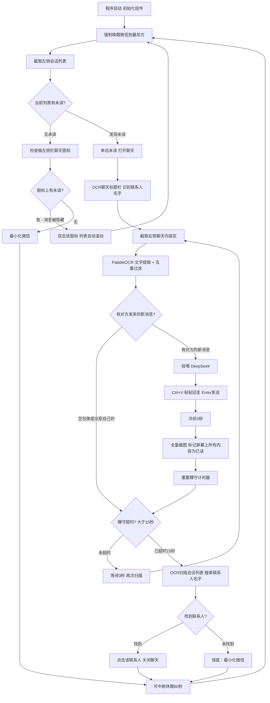

# 微信 GUI Agent 架构及开发记录

## 项目目标
开发一款从零开始、纯视觉、脱离底层协议与内存 Hook 的个人微信 AI 助手，采用 GUI 智能体架构。通过窗口抓取、OCR、大模型与拟人化模拟进行消息收发，实现高兼容性和极高隐私安全。

## 目录结构
```text
/
├── main.py                  # 全局入口：启动 pywebview 窗口，挂载 AppApi 桥接
├── calibrate.py             # 首次使用坐标校准工具（交互式画框）
├── .env                     # 🔒 敏感密钥（LLM API Key），已被 .gitignore 屏蔽
├── .gitignore               # Git 忽略规则
├── core/                    # 核心自动化引擎模块
│   ├── __init__.py
│   ├── engine.py            # WeChatEngine 引擎类（主循环 + 跟踪追击 + 可中断休眠）
│   ├── window_manager.py    # 窗口控制模块（激活、锁定、最小化、DPI 感知）
│   ├── vision.py            # 视觉截屏与 HSV 未读检测（线程安全 mss + 交互式校准）
│   ├── ocr_parser.py        # PaddleOCR 识别与消息解析（归属判断、去重、digest 模式）
│   ├── agent.py             # LLM 大脑模块（DeepSeek/OpenAI 兼容，.env 优先读取）
│   ├── action.py            # 执行层模块（拟人化输出、剪贴板注入、双击）
│   └── anti_risk.py         # 防风控与伪装模块
├── data/                    # 数据与持久化配置
│   ├── config.yaml          # 🔒 个人坐标/参数配置，已被 .gitignore 屏蔽
│   ├── config.example.yaml  # 配置模板文件（供新用户参考）
│   ├── contacts.yaml        # [规划中] 联系人分组与人设绑定
│   └── knowledge/           # [规划中] RAG 本地知识库
├── ui/                      # 图形控制台界面
│   └── index.html           # 单文件前端（HTML+CSS+JS，暗色玻璃拟态主题）
├── requirements.txt         # 项目依赖
├── ARCHITECTURE.md          # 开发文档与架构说明（本文件）
└── README_STRUCTURE.md      # 项目目录结构说明
```

## 开发日志

### 阶段 MVP - M1 环境初始化
**日期**: 2026-03-18 | **状态**: 完成
1. 创建了核心依赖文件 `requirements.txt` 和全局配置 `config.yaml`。
2. 建立了项目骨架代码文件，安装了全部依赖库。

### 阶段 MVP - M2 窗口控制模块
**日期**: 2026-03-18 | **状态**: 完成
1. 完成 `window_manager.py`，实现 DPI 感知和绕过 Windows 前台保护的强制置顶。

### 阶段 MVP - M3 视觉截屏与检测模块
**日期**: 2026-03-18 | **状态**: 完成
1. 完成 `vision.py`，使用 mss 截图和 HSV 色彩空间精准识别红点。
2. 开发了交互式校准工具 `interactive_calibration()`。

### 阶段 MVP - M4 OCR提取与消息解析
**日期**: 2026-03-18 | **状态**: 完成
1. 完成 `ocr_parser.py`，集成 PaddleOCR 本地引擎。
2. 实现身份归属判定（基于文字边界极值坐标，非中心点）和上下文哈希去重。

### 阶段 MVP - M5 LLM 直连大脑
**日期**: 2026-03-19 | **状态**: 完成
1. 完成 `agent.py`，接入 DeepSeek，设计了温暖友善的拟人化 Persona Prompt。

### 阶段 MVP - M6 物理操作动作层
**日期**: 2026-03-19 | **状态**: 完成
1. 完成 `action.py`，使用剪贴板 + Ctrl+V + Enter 模拟真人输入。

### 阶段 MVP - M7 核心主循环
**日期**: 2026-03-19 | **状态**: 完成（V1/V2 已废弃，当前为 V3）

### 阶段 MVP - M8 项目重构
**日期**: 2026-03-19 | **状态**: 完成
1. 将散落的单文件结构拆分为 `core/`、`data/`、`ui/` 三大模块。
2. 原 `main.py` 主循环封装为 `core/engine.py` 中的 `WeChatEngine` 类。
3. 新建根目录 `main.py` 作为全局入口。
4. 新增 `README_STRUCTURE.md` 项目目录地图文档。

### 阶段 MVP - M9 UI 图形控制台
**日期**: 2026-03-19 | **状态**: 完成（MVP 版）
1. 技术选型：采用 **pywebview**（无边框原生窗口 + WebView2 渲染引擎）。
2. 完成前端单文件 `ui/index.html`，实现三个 Tab 面板：监控、配置（占位）、人设（占位）。
3. 实现 JavaScript ↔ Python 双向桥接通信（`window.pywebview.api`）。
4. 完成引擎线程管理：启动/停止/可中断休眠。
5. 完成日志实时推送：`queue.Queue` + 前端 400ms 轮询渲染。
6. 修复 `mss` 线程不安全问题（改为每次截图创建新实例）。
7. 自定义窗口控件：最小化、关闭按钮，移除原生 Windows 标题栏。

### 阶段 MVP - M10 安全与开源准备
**日期**: 2026-03-20 | **状态**: 完成
1. 创建 `.gitignore`，屏蔽 `.env`、`data/config.yaml`、虚拟环境、缓存等敏感/冗余文件。
2. 将 LLM API Key 从 `config.yaml` 中提取到 `.env` 环境变量文件。
3. `agent.py` 改为优先从 `.env` 读取密钥（`python-dotenv`），`config.yaml` 作回退。
4. 创建 `data/config.example.yaml` 干净模板，坐标留空，注释引导新用户运行 `calibrate.py`。
5. 创建独立校准入口脚本 `calibrate.py`，自动从模板复制配置并启动交互式画框。

### 阶段 MVP - M11 回复逻辑重构（V3.1）
**日期**: 2026-03-20 | **状态**: 完成
1. **修复自言自语死循环 Bug**：旧的 `digest_only_me` 模式导致对方秒回永远不被标记已读，产生无限回复。
2. 彻底重写跟踪追击内循环，采用「回复→全量缓存→蹲守」极简三步策略。
3. 冷却时间从 5 秒缩短至 3 秒。
4. 蹲守循环内增加 `is_running` 检查，停止按钮可秒级响应。
5. 过滤逻辑改为只关注 `sender=="them"` 的新消息，AI 自己发的内容不再触发回复。

---

## 主循环 V3.1 架构设计（极简回复 + 全量缓存 + 安全蹲守）

> **V2 的教训：** 双轨扫描引入了大量边界 Bug（自我污染、启动暴走、切换误触）。越修越乱！
> **V3 核心思想：** 只信赖红点。每 60 秒唤醒微信扫描一次，扫完立刻最小化。
> **V3.1 回复策略：** 回复后立刻全量截图缓存（标记屏幕上所有内容为已读），3 秒后开始蹲守，只对「对方发来的真正新消息」做出回复，杜绝自言自语。



### V3.1 关键设计

| 维度 | 说明 |
|------|------|
| **巡逻周期** | 每 60 秒唤醒微信扫描一次，扫完立刻最小化，不影响用户使用电脑 |
| **打开聊天** | 单击未读标志进入聊天界面 |
| **联系人识别** | 进入聊天后 OCR 标题栏，提取当前联系人名字（为后续联系人库做铺垫） |
| **回复策略** | 仅对 `sender=="them"` 的新消息回复，忽略自己和系统消息 |
| **消化策略** | 回复后冷却 3 秒 → 全量截图缓存（包括对方消息），防止重复回复和自言自语 |
| **蹲守机制** | 回复后重置 15 秒倒计时，蹲守期间每 3 秒扫描一次检测新回复 |
| **关闭聊天** | 蹲守超时后，OCR 扫描会话列表搜索联系人名字，找到新位置后点击关闭 |
| **保底策略** | 若 OCR 未识别到名字或在列表中找不到，最小化微信兜底 |
| **防死循环** | 全量缓存确保秒回被标记已读，3 秒后的真正新消息才触发下一轮回复 |

---

## UI 图形控制台架构

### 技术选型：pywebview

| 考量 | 决策 |
|------|------|
| **为什么不用 CustomTkinter？** | Tkinter 事件循环古老，核心引擎的 while True + 高频 OCR + 网络请求会导致主线程白屏假死 |
| **为什么不用 PyQt6？** | 依赖 300MB+，QSS 样式编写繁琐，界面美观度受限 |
| **为什么不用浏览器（FastAPI + Web）？** | 用户明确要求独立桌面 App，不希望打开浏览器 |
| **最终选择 pywebview** | 原生窗口包裹 WebView2，HTML/CSS/JS 做界面，Python 做后端，轻量（~5MB）、线程隔离、颜值无上限 |

### 前后端通信架构

```text
┌─────────────────────────────────────────────┐
│  pywebview 无边框原生窗口 (frameless)        │
│  ┌─────────────────────────────────────────┐ │
│  │ ui/index.html (HTML + CSS + JS)         │ │
│  │                                         │ │
│  │  JS 通过 window.pywebview.api.xxx()     │ │
│  │  调用 Python 后端方法                    │ │
│  └─────────────┬───────────────────────────┘ │
│                │ pywebview JS Bridge          │
│  ┌─────────────┴───────────────────────────┐ │
│  │  main.py → AppApi 类                     │ │
│  │  ├── start_engine()  → 启动引擎线程      │ │
│  │  ├── stop_engine()   → 停止引擎线程      │ │
│  │  ├── get_logs()      → 从 Queue 获取日志  │ │
│  │  ├── minimize_app()  → 最小化窗口        │ │
│  │  └── close_app()     → 关闭窗口          │ │
│  └─────────────┬───────────────────────────┘ │
│                │                             │
│  ┌─────────────┴───────────────────────────┐ │
│  │  core/engine.py (daemon Thread)          │ │
│  │  独立线程运行，绝不卡 UI                  │ │
│  │  log() → queue.Queue → 前端轮询消费      │ │
│  └─────────────────────────────────────────┘ │
└─────────────────────────────────────────────┘
```

### 已解决的关键技术难题

| 问题 | 根因 | 解决方案 |
|------|------|---------|
| mss 截图线程崩溃 | `mss.mss()` 使用 `_thread._local`，不能跨线程 | 每次截图 `with mss.mss() as sct:` 创建新实例 |
| 停止按钮无效 | `engine_thread.is_alive()` 在 60 秒 sleep 期间始终为 True | 改用 `is_running` 标志位判断 + `_interruptible_sleep()` 每秒碎片检测 |
| DevTools 弹窗 | `webview.start(debug=True)` 会弹出开发者工具 | 改为 `debug=False` |
| 二次启动失败 | 旧线程 60 秒 sleep 未退出，新启动被拦截 | `_interruptible_sleep()` 确保 1 秒内响应停止指令 |
| **自言自语死循环** | `digest_only_me=True` 导致对方秒回永不被标记已读，每轮都被当成新消息 | 改为全量缓存 + 只对 `sender=="them"` 的新消息回复 |
| API Key 泄露风险 | 密钥硬编码在 `config.yaml` 中，上传 GitHub 即暴露 | 提取到 `.env`，`agent.py` 优先读取环境变量 |

### UI 面板规划

| Tab | 当前状态 | 功能 |
|-----|---------|------|
| 监控 | ✅ 已完成 | 实时日志流、启动/停止按钮、模型/模式芯片、自定义窗口控件 |
| 配置 | 🚧 占位 | YAML 可视化编辑、API Key 设置、屏幕坐标一键校准 |
| 人设 | 🚧 占位 | 联系人管理、专属 Prompt 编辑、独立上下文配置 |

---

## 新用户快速上手

```bash
# 1. 克隆项目 & 安装依赖
git clone <repo_url>
cd win_WeChat_AI
python -m venv .venv
.venv\Scripts\activate
pip install -r requirements.txt

# 2. 配置 API 密钥（在项目根目录创建 .env 文件）
# LLM_API_KEY=你的密钥
# LLM_BASE_URL=https://api.deepseek.com/v1
# LLM_MODEL=deepseek-chat

# 3. 首次校准坐标（用鼠标画框，自动生成 config.yaml）
python calibrate.py

# 4. 启动图形控制台
python main.py
```
