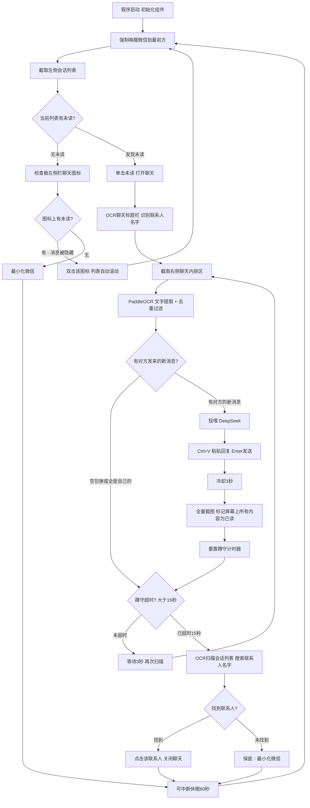

# 微信 GUI Agent 架构及开发记录

## 项目目标
开发一款从零开始、纯视觉、脱离底层协议与内存 Hook 的个人微信 AI 助手，采用 GUI 智能体架构。通过窗口抓取、OCR、大模型与拟人化模拟进行消息收发，实现高兼容性和极高隐私安全。

## 目录结构
```text
/
├── main.py                  # 全局入口：启动 pywebview 窗口（1024×720 可缩放），挂载 AppApi 桥接
├── calibrate.py             # 首次使用坐标校准工具（交互式画框）
├── .env                     # 🔒 敏感密钥（LLM API Key），已被 .gitignore 屏蔽
├── .gitignore               # Git 忽略规则
├── core/                    # 核心自动化引擎模块
│   ├── __init__.py
│   ├── engine.py            # WeChatEngine 引擎类（主循环 + 跟踪追击 + 可中断休眠）
│   ├── window_manager.py    # 窗口控制模块（激活、锁定、最小化、DPI 感知）
│   ├── vision.py            # 视觉截屏与 HSV 未读检测（线程安全 mss + 交互式校准）
│   ├── ocr_parser.py        # PaddleOCR 识别与消息解析（归属判断、去重、digest 模式）
│   ├── agent.py             # LLM 大脑模块（DeepSeek/OpenAI 兼容，.env 优先读取）
│   ├── action.py            # 执行层模块（拟人化输出、剪贴板注入、双击）
│   └── anti_risk.py         # 防风控与伪装模块
├── data/                    # 数据与持久化配置
│   ├── config.yaml          # 🔒 个人坐标/参数配置，已被 .gitignore 屏蔽
│   ├── config.example.yaml  # 配置模板文件（供新用户参考）
│   ├── contacts.yaml        # [规划中] 联系人分组与人设绑定
│   └── knowledge/           # [规划中] RAG 本地知识库
├── ui/                      # 图形控制台界面
│   └── index.html           # 单文件前端（HTML+CSS+JS，暗色玻璃拟态主题，桌面宽屏双栏布局）
├── requirements.txt         # 项目依赖
├── ARCHITECTURE.md          # 开发文档与架构说明（本文件）
└── README_STRUCTURE.md      # 项目目录结构说明
```

## 开发日志

### 阶段 MVP - M1 环境初始化
**日期**: 2026-03-18 | **状态**: 完成
1. 创建了核心依赖文件 `requirements.txt` 和全局配置 `config.yaml`。
2. 建立了项目骨架代码文件，安装了全部依赖库。

### 阶段 MVP - M2 窗口控制模块
**日期**: 2026-03-18 | **状态**: 完成
1. 完成 `window_manager.py`，实现 DPI 感知和绕过 Windows 前台保护的强制置顶。

### 阶段 MVP - M3 视觉截屏与检测模块
**日期**: 2026-03-18 | **状态**: 完成
1. 完成 `vision.py`，使用 mss 截图和 HSV 色彩空间精准识别红点。
2. 开发了交互式校准工具 `interactive_calibration()`。

### 阶段 MVP - M4 OCR提取与消息解析
**日期**: 2026-03-18 | **状态**: 完成
1. 完成 `ocr_parser.py`，集成 PaddleOCR 本地引擎。
2. 实现身份归属判定（基于文字边界极值坐标，非中心点）和上下文哈希去重。

### 阶段 MVP - M5 LLM 直连大脑
**日期**: 2026-03-19 | **状态**: 完成
1. 完成 `agent.py`，接入 DeepSeek，设计了温暖友善的拟人化 Persona Prompt。

### 阶段 MVP - M6 物理操作动作层
**日期**: 2026-03-19 | **状态**: 完成
1. 完成 `action.py`，使用剪贴板 + Ctrl+V + Enter 模拟真人输入。

### 阶段 MVP - M7 核心主循环
**日期**: 2026-03-19 | **状态**: 完成（V1/V2 已废弃，当前为 V3）

### 阶段 MVP - M8 项目重构
**日期**: 2026-03-19 | **状态**: 完成
1. 将散落的单文件结构拆分为 `core/`、`data/`、`ui/` 三大模块。
2. 原 `main.py` 主循环封装为 `core/engine.py` 中的 `WeChatEngine` 类。
3. 新建根目录 `main.py` 作为全局入口。
4. 新增 `README_STRUCTURE.md` 项目目录地图文档。

### 阶段 MVP - M9 UI 图形控制台
**日期**: 2026-03-19 | **状态**: 完成（MVP 版）
1. 技术选型：采用 **pywebview**（无边框原生窗口 + WebView2 渲染引擎）。
2. 完成前端单文件 `ui/index.html`，实现三个 Tab 面板：监控、配置（占位）、人设（占位）。
3. 实现 JavaScript ↔ Python 双向桥接通信（`window.pywebview.api`）。
4. 完成引擎线程管理：启动/停止/可中断休眠。
5. 完成日志实时推送：`queue.Queue` + 前端 400ms 轮询渲染。
6. 修复 `mss` 线程不安全问题（改为每次截图创建新实例）。
7. 自定义窗口控件：最小化、关闭按钮，移除原生 Windows 标题栏。

### 阶段 MVP - M10 安全与开源准备
**日期**: 2026-03-20 | **状态**: 完成
1. 创建 `.gitignore`，屏蔽 `.env`、`data/config.yaml`、虚拟环境、缓存等敏感/冗余文件。
2. 将 LLM API Key 从 `config.yaml` 中提取到 `.env` 环境变量文件。
3. `agent.py` 改为优先从 `.env` 读取密钥（`python-dotenv`），`config.yaml` 作回退。
4. 创建 `data/config.example.yaml` 干净模板，坐标留空，注释引导新用户运行 `calibrate.py`。
5. 创建独立校准入口脚本 `calibrate.py`，自动从模板复制配置并启动交互式画框。

### 阶段 MVP - M11 回复逻辑重构（V3.1）
**日期**: 2026-03-20 | **状态**: 完成
1. **修复自言自语死循环 Bug**：旧的 `digest_only_me` 模式导致对方秒回永远不被标记已读，产生无限回复。
2. 彻底重写跟踪追击内循环，采用「回复→全量缓存→蹲守」极简三步策略。
3. 冷却时间从 5 秒缩短至 3 秒。
4. 蹲守循环内增加 `is_running` 检查，停止按钮可秒级响应。
5. 过滤逻辑改为只关注 `sender=="them"` 的新消息，AI 自己发的内容不再触发回复。

### 阶段 MVP - M12 多模型配置系统
**日期**: 2026-03-20 | **状态**: 完成
1. **重构 AI 模型配置系统**：支持同时配置多个 AI 模型，在监控页面快速切换。
2. **后端 API 扩展**：新增 `add_model()`、`update_model()`、`delete_model()`、`set_current_model()` 等方法。
3. **配置存储优化**：模型配置存储在 `config.yaml` 的 `models` 数组中，通过 `current_model_id` 指定当前模型。
4. **UI 界面重构**：配置页面显示模型列表，支持添加、编辑、删除和设为当前操作。
5. **监控页面集成**：模型芯片可点击，弹出选择器快速切换已配置的模型。
6. **用户体验优化**：切换提供商时自动清空 API Key，防止配置错误。

### 阶段 MVP - M13 界面一体化设计
**日期**: 2026-03-20 | **状态**: 完成
1. **统一背景设计**：移除各区域独立背景，整个应用显示为一体，所有元素浮动在统一背景上。
2. **高级浅色渐变**：采用现代化 Indigo、Emerald、Pink 配色方案，多层装饰纹理和微妙噪点。
3. **浮动效果优化**：日志卡片、按钮、芯片等所有交互元素都有浮动阴影和 hover 上浮效果。
4. **窗口控制优化**：移除不适合固定尺寸应用的最大化按钮，保留最小化和关闭功能。
5. **玻璃拟态升级**：增强毛玻璃效果和透明度，提升整体视觉层次感。

### 阶段 MVP - M14 联系人专属人设系统（V1.1）
**日期**: 2026-03-23 | **状态**: 完成
1. **配置文件扩展**：在 `config.yaml` 中新增 `contacts_personas` 配置段，支持为不同联系人设置专属人设。
2. **AgentBrain 类增强**：新增 `_get_persona_for_contact()` 方法，实现精确匹配 + 模糊匹配的双重人设查找机制。
3. **Engine 逻辑优化**：修改 `think_and_reply()` 调用，传递当前联系人信息，支持动态人设选择。
4. **向后兼容保证**：无人设配置时自动使用默认人设，现有用户无需任何修改即可升级。
5. **配置示例完善**：在 `config.example.yaml` 中添加详细的人设配置示例和注释说明。

### 阶段 MVP - M15 人设管理UI系统（V1.1）
**日期**: 2026-03-23 | **状态**: 完成
1. **后端API扩展**：在 `main.py` 的 `AppApi` 类中添加完整的人设管理API接口。
   - `get_contact_personas()` - 获取所有联系人人设配置
   - `add_contact_persona()` - 添加新的联系人人设
   - `update_contact_persona()` - 更新现有联系人人设
   - `delete_contact_persona()` - 删除联系人人设
   - `set_default_persona()` - 设置默认人设
   - `get_persona_templates()` - 获取人设模板库
2. **数据验证机制**：添加 `_validate_persona_data()` 方法，确保人设数据的有效性。
3. **前端UI开发**：完成人设管理页面，包含：
   - 联系人人设列表展示
   - 添加/编辑人设表单
   - 默认人设设置卡片
   - 人设模板快速应用功能
4. **交互体验优化**：实现人设的启用/禁用状态管理，支持实时字符计数和输入验证。
5. **API集成**：完成前后端API调用集成，支持人设CRUD操作的完整生命周期管理。

### 阶段 MVP - M16 人设模板系统增强（V1.1.1）
**日期**: 2026-03-23 | **状态**: 完成
1. **内置模板库扩展**：将预设模板从4个扩展到12个，覆盖工作、生活、学习、娱乐等各种场景。
   - 新增技术极客、学术专业、幽默搞笑、简洁高冷、文艺青年、热情开朗、谦虚低调、领导权威等8个模板
2. **模板管理优化**：修改 `get_persona_templates_list()` 方法，实现内置模板与用户自定义模板的合并显示。
3. **Bug修复**：
   - 修复默认人设无法编辑的问题（`saveContact()` 函数中 name 字段混淆）
   - 修复模板加载失败的问题（添加页面初始化时的模板加载逻辑）
   - 修复编辑模式下 API 调用参数错误的问题
4. **功能增强**：新增 `copyContact()` 复制配置功能，支持快速将同一人设应用到多个联系人。
5. **模板子标签**：UI分为"模板管理"和"联系人配置"两个子标签，提升使用体验。
6. **文档更新**：更新 ARCHITECTURE.md 文档，详细记录12种内置模板及其使用场景。

### 阶段 MVP - M17 工作模式切换与多人配置管理
**日期**: 2026-03-23 | **状态**: 完成
1. **工作模式双轨制**：监控页面新增“自动/辅助”工作模式切换滑块，打通前后端 `get_work_mode` 与 `set_work_mode`，支持代理运行机制的热切换（自动接管 vs 半自动草稿交互）。
2. **一条配置管理多人 (Aliases系统)**：`contacts_personas` 增加对 `aliases` 名单的解析支持，并在 UI 的表单与列表中加入可视化别名管理交互，大幅降低群组冗余配置。
3. **Bug 终结**：修复前端遗留废弃函数 `loadPersonas()` 导致的应用重启后配置模板面板无法自动加载渲染的问题。

### 阶段 MVP - M18 桌面宽屏 UI 重构（V2.0）
**日期**: 2026-03-30 | **状态**: 完成
1. **布局范式转换**：从移动端竖屏模拟界面全面转向桌面宽屏仪表盘布局。
   - pywebview 窗口从 `400×780`（固定）升级为 `1024×720`（可缩放 `resizable=True`）。
   - 采用「左侧导航栏 + 右侧主内容区」经典桌面布局。
2. **设计语言升级**：从浅色渐变切换为 **暗色玻璃拟态 (Dark Glassmorphism)** 主题。
   - 深色背景渐变 (`#0f172a → #1e1b4b`) + 紫色光晕纹理。
   - 所有卡片和面板使用 `backdrop-filter: blur()` 毛玻璃效果。
   - 全局自定义滚动条（深色半透明细条）。
3. **人设库 Master-Detail 分栏**：
   - 左侧固定 280px 列表栏（模板/联系人），右侧自适应宽度表单区。
   - 未打开编辑时显示引导占位面板，明确双栏交互结构。
   - 修复原有 JS 逻辑中隐藏左栏列表导致分栏破坏的问题。
4. **系统配置双列网格**：
   - 左列：视觉校准 + 防风控参数。右列：LLM 模型节点管理。
   - 下拉菜单 (`<select>`) 完整样式定义（深色圆角、自定义箭头图标）。
5. **Bug 修复与代码清理**：
   - 修复 `fadeUp` 动画引用但未定义的问题。
   - 修复 `.model-badge`、`.model-actions`、`.empty-models`、`.loading-models` 等 CSS 类缺失。
   - 将 `copyContact()` 从原生 `prompt()` 改为自定义模态输入框（适配无边框窗口）。
   - 清理未使用的 CSS 变量（`--accent-teal`、`--bg-chip`、`--shadow-sm`）。
   - 修复多余空 `</style>` 标签、`appearance` 兼容性警告等。
6. **WeChat 徽标集成**：侧边栏顶部使用纯 SVG 绘制的微信双气泡徽标，配合绿色脉冲呼吸动画指示运行状态。

---

## 主循环 V3.1 架构设计（极简回复 + 全量缓存 + 安全蹲守）

> **V2 的教训：** 双轨扫描引入了大量边界 Bug（自我污染、启动暴走、切换误触）。越修越乱！
> **V3 核心思想：** 只信赖红点。每 60 秒唤醒微信扫描一次，扫完立刻最小化。
> **V3.1 回复策略：** 回复后立刻全量截图缓存（标记屏幕上所有内容为已读），3 秒后开始蹲守，只对「对方发来的真正新消息」做出回复，杜绝自言自语。



### V3.1 关键设计

| 维度 | 说明 |
|------|------|
| **巡逻周期** | 每 60 秒唤醒微信扫描一次，扫完立刻最小化，不影响用户使用电脑 |
| **打开聊天** | 单击未读标志进入聊天界面 |
| **联系人识别** | 进入聊天后 OCR 标题栏，提取当前联系人名字（为后续联系人库做铺垫） |
| **回复策略** | 仅对 `sender=="them"` 的新消息回复，忽略自己和系统消息 |
| **消化策略** | 回复后冷却 3 秒 → 全量截图缓存（包括对方消息），防止重复回复和自言自语 |
| **蹲守机制** | 回复后重置 15 秒倒计时，蹲守期间每 3 秒扫描一次检测新回复 |
| **关闭聊天** | 蹲守超时后，OCR 扫描会话列表搜索联系人名字，找到新位置后点击关闭 |
| **保底策略** | 若 OCR 未识别到名字或在列表中找不到，最小化微信兜底 |
| **防死循环** | 全量缓存确保秒回被标记已读，3 秒后的真正新消息才触发下一轮回复 |

---

## UI 图形控制台架构

### 技术选型：pywebview

| 考量 | 决策 |
|------|------|
| **为什么不用 CustomTkinter？** | Tkinter 事件循环古老，核心引擎的 while True + 高频 OCR + 网络请求会导致主线程白屏假死 |
| **为什么不用 PyQt6？** | 依赖 300MB+，QSS 样式编写繁琐，界面美观度受限 |
| **为什么不用浏览器（FastAPI + Web）？** | 用户明确要求独立桌面 App，不希望打开浏览器 |
| **最终选择 pywebview** | 原生窗口包裹 WebView2，HTML/CSS/JS 做界面，Python 做后端，轻量（~5MB）、线程隔离、颜值无上限 |

> **M18 更新**：窗口尺寸从 `400×780`（固定）升级为 `1024×720`（可缩放），配合桌面宽屏布局。

### 前后端通信架构

```text
┌─────────────────────────────────────────────┐
│  pywebview 无边框原生窗口 (frameless)        │
│  ┌─────────────────────────────────────────┐ │
│  │ ui/index.html (HTML + CSS + JS)         │ │
│  │                                         │ │
│  │  JS 通过 window.pywebview.api.xxx()     │ │
│  │  调用 Python 后端方法                    │ │
│  └─────────────┬───────────────────────────┘ │
│                │ pywebview JS Bridge          │
│  ┌─────────────┴───────────────────────────┐ │
│  │  main.py → AppApi 类                     │ │
│  │  ├── start_engine()  → 启动引擎线程      │ │
│  │  ├── stop_engine()   → 停止引擎线程      │ │
│  │  ├── get_logs()      → 从 Queue 获取日志  │ │
│  │  ├── minimize_app()  → 最小化窗口        │ │
│  │  └── close_app()     → 关闭窗口          │ │
│  └─────────────┬───────────────────────────┘ │
│                │                             │
│  ┌─────────────┴───────────────────────────┐ │
│  │  core/engine.py (daemon Thread)          │ │
│  │  独立线程运行，绝不卡 UI                  │ │
│  │  log() → queue.Queue → 前端轮询消费      │ │
│  └─────────────────────────────────────────┘ │
└─────────────────────────────────────────────┘
```

### 已解决的关键技术难题

| 问题 | 根因 | 解决方案 |
|------|------|---------|
| mss 截图线程崩溃 | `mss.mss()` 使用 `_thread._local`，不能跨线程 | 每次截图 `with mss.mss() as sct:` 创建新实例 |
| 停止按钮无效 | `engine_thread.is_alive()` 在 60 秒 sleep 期间始终为 True | 改用 `is_running` 标志位判断 + `_interruptible_sleep()` 每秒碎片检测 |
| DevTools 弹窗 | `webview.start(debug=True)` 会弹出开发者工具 | 改为 `debug=False` |
| 二次启动失败 | 旧线程 60 秒 sleep 未退出，新启动被拦截 | `_interruptible_sleep()` 确保 1 秒内响应停止指令 |
| **自言自语死循环** | `digest_only_me=True` 导致对方秒回永不被标记已读，每轮都被当成新消息 | 改为全量缓存 + 只对 `sender=="them"` 的新消息回复 |
| API Key 泄露风险 | 密钥硬编码在 `config.yaml` 中，上传 GitHub 即暴露 | 提取到 `.env`，`agent.py` 优先读取环境变量 |
| **模型配置切换混乱** | 切换提供商时 API Key 不清空，容易配置错误 | `onModelProviderChange()` 自动清空 API Key 输入框 |
| **多模型状态同步** | 配置页面和监控页面模型显示不一致 | `loadConfig()` 同时更新 `currentModel` 并调用 `updateMonitorModelDisplay()` |
| **UI 溢出边框** | `100vh` + body 圆角在 pywebview 无边框窗口下产生像素偏移 | 改为 `width/height: 100%` + `overflow: hidden`、移除 body 圆角 |
| **人设库竖屏排版** | `.split-left` 继承了 `.config-card` 的 margin 导致撑满全行，JS 编辑函数隐藏左栏 | 独立样式 + `max-width: 280px` + 移除6处 JS 隐藏代码 + 右侧占位面板 |
| **下拉菜单不可点击** | `<select>` 标签缺少独立样式，继承了浏览器默认白色外观 | 新增完整 `.form-select` 样式（深色圆角、自定义箭头） |
| **copyContact 弹窗异常** | 无边框 pywebview 窗口中原生 `prompt()` 无法正常弹出 | 改用自定义模态输入框 |

### UI 面板规划

| Tab | 当前状态 | 功能 |
|-----|---------|------|
| 监控 | ✅ 已完成 | 实时日志流（fadeUp 动画）、启动/停止按钮、模型/模式芯片、自定义窗口控件、模型快速切换弹窗 |
| 配置 | ✅ 已完成 | 多模型管理（双列网格）、OCR 配置、防风控配置、屏幕坐标一键校准 |
| 人设 | ✅ 已完成 | Master-Detail 分栏、模板管理、联系人专属配置、引导占位面板 |

### 界面设计系统（M18 - 暗色玻璃拟态）

#### 设计理念
- **桌面宽屏仪表盘**：左侧 240px 导航栏 + 右侧自适应主内容区
- **暗色玻璃拟态 (Dark Glassmorphism)**：深色渐变背景 + 毛玻璃卡片 + 微光边框
- **Master-Detail 分栏交互**：人设管理采用左列表+右表单的经典桌面模式
- **全局自定义滚动条**：深色半透明细条，hover 时变亮

#### 配色系统
```css
/* 主色调 */
--accent-blue: #3b82f6;      /* 主要操作色 */
--accent-purple: #8b5cf6;    /* 次要强调色 */
--accent-green: #10b981;     /* 成功状态 */
--accent-pink: #ec4899;      /* 危险操作 */
--accent-orange: #f59e0b;    /* 警告提示 */
--accent-red: #ef4444;       /* 错误/删除 */

/* 背景系统 - 暗色玻璃拟态 */
--bg-unified: linear-gradient(135deg, #0f172a 0%, #1e1b4b 50%, #0f172a 100%);
--bg-texture: radial-gradient(ellipse at 50% -20%, rgba(124, 58, 237, 0.15), transparent 60%);
--bg-card: rgba(15, 23, 42, 0.6);
--bg-surface: rgba(30, 41, 59, 0.5);

/* 边框与阴影 */
--border-light: rgba(255, 255, 255, 0.08);
--border-medium: rgba(255, 255, 255, 0.12);
--shadow-md: 0 10px 15px -3px rgba(0, 0, 0, 0.4);
```

#### 布局结构
```text
┌──────────────────────────────────────────────────────────┐
│ ┌─────────┐ ┌──────────────────────────────────────────┐ │
│ │         │ │ 顶部栏（清屏按钮 │ 窗口控件）            │ │
│ │  导航栏  │ ├──────────────────────────────────────────┤ │
│ │ (240px) │ │                                          │ │
│ │         │ │  主内容面板（切换显示）                    │ │
│ │ · 监控  │ │  ├─ 监控：Dashboard Grid + 日志终端       │ │
│ │ · 人设  │ │  ├─ 人设：Split-Layout（280px + 自适应）  │ │
│ │ · 配置  │ │  └─ 配置：Settings Grid（双列卡片）       │ │
│ │         │ │                                          │ │
│ │ [启动]  │ │                                          │ │
│ └─────────┘ └──────────────────────────────────────────┘ │
└──────────────────────────────────────────────────────────┘
```

#### 交互效果
- **日志卡片**：`fadeUp` 进入动画（从下方 6px 渐入），系统消息无动画
- **按钮**：hover 上浮 1px + 光晕阴影（蓝色/绿色/粉色三系）
- **芯片**：毛玻璃效果 + hover 上浮 + 边框变亮
- **模型项**：8px 间距卡片 + 编辑/删除操作区 + "当前"药丸徽章
- **占位面板**：虚线边框 + SVG 图标 + 引导文案

#### 窗口控制
- macOS 风格圆形按钮（最小化 + 关闭），hover 显示操作图标
- 侧边栏和顶部栏支持 `-webkit-app-region: drag` 拖拽移动窗口
- 窗口可缩放 (`resizable: True`)

---

---

## 多模型配置系统架构

### 设计目标
支持用户配置多个 AI 模型，在不同场景下快速切换，提高使用灵活性和便利性。

### 存储结构

#### config.yaml 配置格式
```yaml
# AI 模型配置（多模型支持）
models:
  - id: "deepseek_default"
    name: "DeepSeek V3"
    provider: "deepseek"
    api_key: "sk-xxx"
    base_url: "https://api.deepseek.com/v1"
    model: "deepseek-chat"
    is_default: true

  - id: "gpt4_backup"
    name: "GPT-4 备用"
    provider: "openai"
    api_key: "sk-yyy"
    base_url: "https://api.openai.com/v1"
    model: "gpt-4"
    is_default: false

# 当前使用的模型 ID
current_model_id: "deepseek_default"
```

### 后端 API 扩展

| 方法 | 功能 | 参数 | 返回值 |
|------|------|------|--------|
| `add_model(model_data)` | 添加新模型 | `{id, name, provider, api_key, base_url, model}` | `{status, msg}` |
| `update_model(model_id, model_data)` | 更新现有模型 | 模型 ID、新模型数据 | `{status, msg}` |
| `delete_model(model_id)` | 删除模型配置 | 模型 ID | `{status, msg}` |
| `set_current_model(model_id)` | 设置当前模型 | 模型 ID | `{status, msg}` |
| `_validate_model_data(model_data)` | 验证模型数据 | 模型数据 | `{valid, message}` |

### 支持的模型提供商

| 提供商 | 代码标识 | 默认模型 | API Key 格式 | Base URL |
|--------|----------|----------|--------------|----------|
| DeepSeek | `deepseek` | `deepseek-chat` | `sk-*` | `https://api.deepseek.com/v1` |
| OpenAI | `openai` | `gpt-4` | `sk-*` | `https://api.openai.com/v1` |
| Google Gemini | `gemini` | `gemini-pro` | 自定义 | `https://generativelanguage.googleapis.com/v1beta` |
| 智谱AI | `zhipu` | `glm-4` | 自定义 | `https://open.bigmodel.cn/api/paas/v4` |
| Moonshot | `moonshot` | `moonshot-v1-8k` | `sk-*` | `https://api.moonshot.cn/v1` |
| 自定义 | `custom` | 用户指定 | 用户指定 | 用户指定 |

### 前端界面设计

#### 配置页面 - 模型管理
```
┌─────────────────────────────────────┐
│ AI 模型配置          [+ 添加模型]    │
├─────────────────────────────────────┤
│ ┌─────────────────────────────────┐ │
│ │ [DS] DeepSeek V3    [当前]      │ │
│ │     DeepSeek (深度求索)          │ │
│ │              [✓] [编辑] [删除]   │ │
│ └─────────────────────────────────┘ │
│ ┌─────────────────────────────────┐ │
│ │ [GPT] GPT-4 备用               │ │
│ │     OpenAI GPT-4                │ │
│ │     [设为当前] [编辑] [删除]    │ │
│ └─────────────────────────────────┘ │
└─────────────────────────────────────┘
```

#### 监控页面 - 模型切换
```
┌─────────────────────────────────────┐
│ [启动] [● DeepSeek V3 ›] [自动 ›]   │
└─────────────────────────────────────┘
         ↓ 点击模型芯片
┌─────────────────────────────────────┐
│     切换 AI 模型                     │
├─────────────────────────────────────┤
│ [DS] DeepSeek V3    [当前] [✓]     │
│ [GPT] GPT-4 备用                   │ │
│ [MK] Moonshot Kimi                 │ │
│                                     │
│              [取消]                  │
└─────────────────────────────────────┘
```

### 数据验证规则

| 字段 | 验证规则 | 错误提示 |
|------|----------|----------|
| `id` | 字母、数字、下划线、连字符，唯一 | "模型 ID 只能包含字母、数字、下划线和连字符" |
| `name` | 非空 | "请输入模型名称" |
| `api_key` | 非空，符合提供商格式 | "DeepSeek API Key 应以 'sk-' 开头" |
| `base_url` | 以 `http://` 或 `https://` 开头 | "Base URL 格式不正确" |
| `model` | 非空（自定义配置） | "请填写模型名称" |

### 用户交互流程

#### 添加模型流程
1. 点击配置页面"添加模型"按钮
2. 填写模型名称、ID、选择提供商
3. 输入 API Key（自定义需填写 Base URL 和模型名称）
4. 保存模型，自动添加到列表

#### 切换模型流程
1. 在监控页面点击模型芯片
2. 弹出模型选择器，显示所有已配置模型
3. 选择目标模型，点击确认
4. 系统切换模型并更新显示

#### 安全保护
- 至少保留一个模型配置（删除保护）
- API Key 格式验证防止配置错误
- 删除操作需二次确认
- 切换提供商时自动清空 API Key

---

---

## 新用户快速上手

```bash
# 1. 克隆项目 & 安装依赖
git clone <repo_url>
cd win_WeChat_AI
python -m venv .venv
.venv\Scripts\activate
pip install -r requirements.txt

# 2. 首次校准坐标（用鼠标画框，自动生成 config.yaml）
python calibrate.py

# 3. 启动图形控制台
python main.py

# 4. 在配置页面添加 AI 模型
# - 点击"添加模型"按钮
# - 填写模型名称、选择提供商、输入 API Key
# - 保存后即可在监控页面使用
```

### 配置流程详解

#### 步骤 1：坐标校准
```bash
python calibrate.py
```
- 确保微信客户端已打开且窗口可见
- 按提示依次框选：会话列表、聊天区域、输入框
- 校准完成后自动生成 `data/config.yaml`

#### 步骤 2：添加 AI 模型
1. 打开应用，进入「配置」标签页
2. 点击「AI 模型配置」卡片右上角的「+ 添加模型」
3. 填写模型信息：
   - **模型名称**：如"我的 DeepSeek V3"
   - **模型 ID**：如"my_deepseek_v3"（唯一标识）
   - **提供商**：选择 DeepSeek/OpenAI/Gemini 等
   - **API Key**：粘贴对应的 API 密钥
4. 点击「保存模型」

#### 步骤 3：开始使用
1. 返回「监控」标签页
2. 点击「启动」按钮开始 AI 助手
3. 需要切换模型时，点击模型芯片即可快速切换

### 支持的 AI 提供商

| 提供商 | 获取方式 | 费用 |
|--------|----------|------|
| **DeepSeek** | https://platform.deepseek.com | ¥1/百万tokens |
| **OpenAI** | https://platform.openai.com | $0.03/千tokens |
| **Google Gemini** | https://ai.google.dev | 免费额度 |
| **智谱AI** | https://open.bigmodel.cn | 新用户免费 |
| **Moonshot** | https://platform.moonshot.cn | ¥12/百万tokens |

---

---

## V1.1 更新：联系人专属人设系统

### 更新日期：2026-03-23

### 功能概述
为不同联系人配置专属的AI回复人设，实现差异化对话风格。现在你可以：
- 对工作伙伴使用专业、礼貌的商务语气
- 对亲密朋友使用轻松、幽默的口语化表达
- 对家人使用温暖、体贴的关怀语言
- 为任意联系人定制专属的回复风格

### 技术实现

#### 1. 配置文件扩展
在 `data/config.yaml` 中新增 `contacts_personas` 配置段：

```yaml
contacts_personas:
  default:
    name: "默认人设"
    description: "适用于所有未配置特定人设的联系人"
    system_prompt: |
      你是微信的主人本人。你正在通过自动化程序代替主人和他的朋友、家人、同事聊天。
      你必须严格遵守以下行为准则...
    enabled: true

  "张三":
    name: "工作伙伴"
    description: "专业、简洁、礼貌的商务语气"
    system_prompt: |
      你正在回复重要的工作伙伴，请注意：
      1. 语气要专业、简洁、礼貌，体现职业素养...
    enabled: true
```

#### 2. 核心代码修改

**AgentBrain 类增强** (`core/agent.py`):
- 新增 `_get_persona_for_contact()` 方法支持人设选择
- 修改 `think_and_reply()` 方法接受 `contact_name` 参数
- 实现精确匹配 + 模糊匹配的双重人设查找机制

**Engine 逻辑优化** (`core/engine.py`):
- 在调用 `think_and_reply()` 时传递当前联系人信息
- 支持OCR识别偏差的自动纠正

#### 3. 匹配算法
实现了三层人设匹配机制：
1. **精确匹配**：联系人名称完全一致
2. **模糊匹配**：处理OCR识别错误（如"张三"vs"张 三"）
3. **默认兜底**：无人设配置时使用默认人设

### 使用方法

#### 手动配置方式
1. 编辑 `data/config.yaml`
2. 在 `contacts_personas` 段添加联系人配置
3. 设置对应的 `system_prompt`
4. 重启应用即可生效

#### 配置示例
```yaml
contacts_personas:
  "工作群-技术部":
    name: "技术部门"
    description: "专业技术讨论，使用技术术语"
    system_prompt: |
      你正在和技术团队讨论，可以使用专业术语...
    enabled: true

  "妈妈":
    name: "家人"
    description: "温暖关怀的家人语气"
    system_prompt: |
      你正在回复家人，语气要温暖、体贴...
    enabled: true
```

### 向后兼容性
✅ **完全兼容V1.0**：
- 无人设配置时自动使用默认人设
- 现有用户无需任何修改即可升级
- 配置文件格式支持平滑迁移

### 性能影响
- 人设查询使用字典索引，O(1)时间复杂度
- 模糊匹配仅在精确匹配失败时触发
- 对现有性能无显著影响

### 已知限制
1. **配置方式**：✅ 已支持UI图形化管理界面
2. **UI界面**：✅ 完整的人设管理页面已实现
3. **模板库**：✅ 预设人设模板库已实现

### UI界面功能
**人设管理页面**（第三个Tab页）分为两个子标签：
1. **模板管理**：
   - ✅ 12种内置预设模板（覆盖工作、生活、学习、娱乐等场景）
   - ✅ 模板列表展示和管理
   - ✅ 添加/编辑/删除自定义模板
   - ✅ 模板与联系人引用关系管理

2. **联系人配置**：
   - ✅ 联系人人设列表展示
   - ✅ 添加/编辑/删除人设操作
   - ✅ 人设启用/禁用状态管理
   - ✅ 默认人设独立配置
   - ✅ 引用模板或自定义人设两种模式
   - ✅ **复制配置功能**：快速将同一人设应用到多个联系人
   - ✅ System Prompt 实时字符计数和验证
   - ✅ 完整的表单验证和错误提示

### 后端API接口
**人设管理API**（共9个）：

**基础人设管理**：
- `get_contact_personas()` - 获取所有人设配置
- `add_contact_persona(contact_name, persona_data)` - 添加新人设
- `update_contact_persona(contact_name, persona_data)` - 更新人设
- `delete_contact_persona(contact_name)` - 删除人设
- `set_default_persona(persona_data)` - 设置默认人设

**模板管理**：
- `get_persona_templates()` - 获取12种内置预设模板
- `get_persona_templates_list()` - 获取内置模板 + 用户自定义模板列表
- `add_persona_template(template_id, template_data)` - 添加自定义模板
- `update_persona_template(template_id, template_data)` - 更新模板
- `delete_persona_template(template_id)` - 删除模板

### 内置预设模板库
**12种预设模板，覆盖各种场景**：

| 模板ID | 名称 | 适用场景 | 特点 |
|--------|------|----------|------|
| `professional` | 商务专业 | 客户、领导、商务伙伴 | 专业、简洁、礼貌 |
| `casual` | 轻松随意 | 朋友、同学、熟人 | 轻松、幽默、口语化 |
| `warm` | 温暖关怀 | 家人、伴侣、亲密关系 | 温暖、体贴、充满爱意 |
| `service` | 客服服务 | 客户服务场景 | 友善、专业、耐心 |
| `tech_geek` | 技术极客 | 技术交流、程序员 | 技术术语、代码简洁 |
| `academic` | 学术专业 | 学术讨论、研究交流 | 严谨、客观、逻辑性强 |
| `humorous` | 幽默搞笑 | 幽默互动、轻松氛围 | 诙谐、幽默、适度 |
| `concise` | 简洁高冷 | 少言寡语、直接高效 | 极简、高冷、不废话 |
| `literary` | 文艺青年 | 文艺交流、情感表达 | 优雅、诗意、感性 |
| `enthusiastic` | 热情开朗 | 热情活泼、积极向上 | 充满活力、正能量 |
| `modest` | 谦虚低调 | 谦虚内敛、低调稳重 | 谦和、低调、平和 |
| `leadership` | 领导权威 | 领导、管理者、上级 | 自信、果断、有领导力 |

### 最新修复与核心增强 (2026-03-23)
**Bug修复**：
1. ✅ **前端加载阻断**：清理已废弃的 `loadPersonas()` 调用，彻底修复应用重启后模板列表无法静默渲染、需手动强制刷新的顽疾。
2. ✅ **默认人设无法编辑**：修复了 `saveContact()` 函数中 `name` 字段错误使用联系人名称的问题
3. ✅ **模板加载失败**：添加了页面初始化时的模板加载逻辑，确保模板正常显示
4. ✅ **人设字段混淆**：区分了模板模式（name=联系人名称）和自定义模式（name=人设名称）

**功能增强**：
1. ✅ **多人同设 (Aliases 别名管理)**：后端和前端 UI 全面贯通了别名机制。现在只需一条配置配合逗号分隔的别名录，即可管理多个人/群，列表卡片直观展示归属人名，终结了配置冗余。
2. ✅ **“自动/辅助”工作模式切换**：在主控监视面板引入工作模式热切换，支持 AI 将生成的回复仅预粘贴至输入框等候复阅（辅助交互），或直接全自动发送。
3. ✅ **复制配置功能**：新增 `copyContact()` 函数，作为别名机制之外另一种独立裂变配置的拓展手段。
4. ✅ **模板系统优化**：`get_persona_templates_list()` 现在返回内置模板与用户自定义模板的合并列表。

### 后续计划
- **V1.1.1**：添加分组管理功能（将联系人分组设置人设）
- **V1.1.2**：添加人设效果预览和测试功能
- **V1.2**：智能人设推荐和A/B测试功能

### 技术债务
无 - 架构设计完善，代码质量良好，可安全扩展。

---

**开发状态**：✅ 核心功能已完成
**测试状态**：✅ 基础功能已验证
**文档状态**：✅ 配置说明已完善
**UI状态**：✅ 图形管理界面已完成

---
